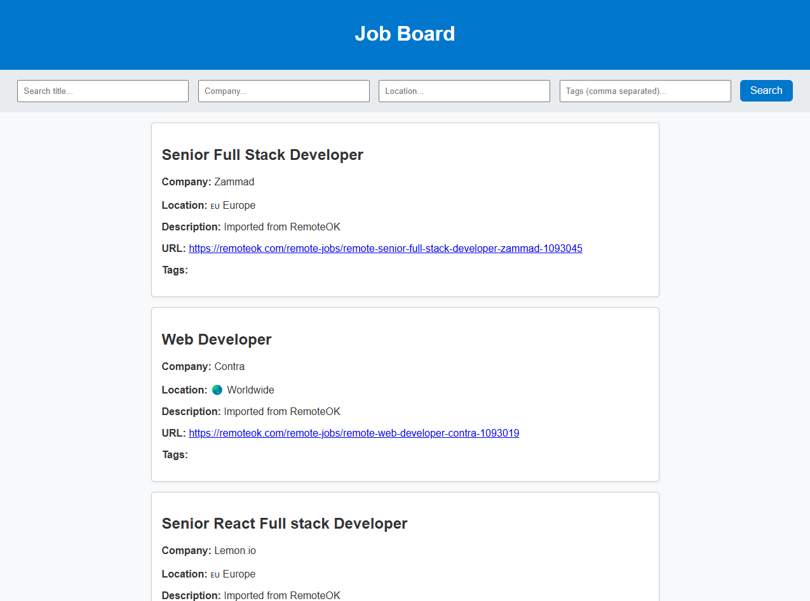
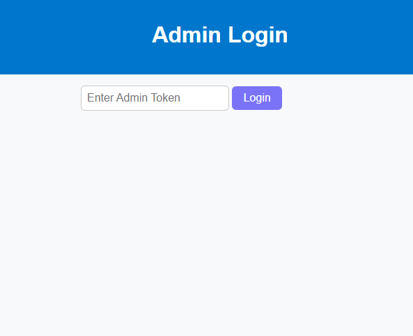
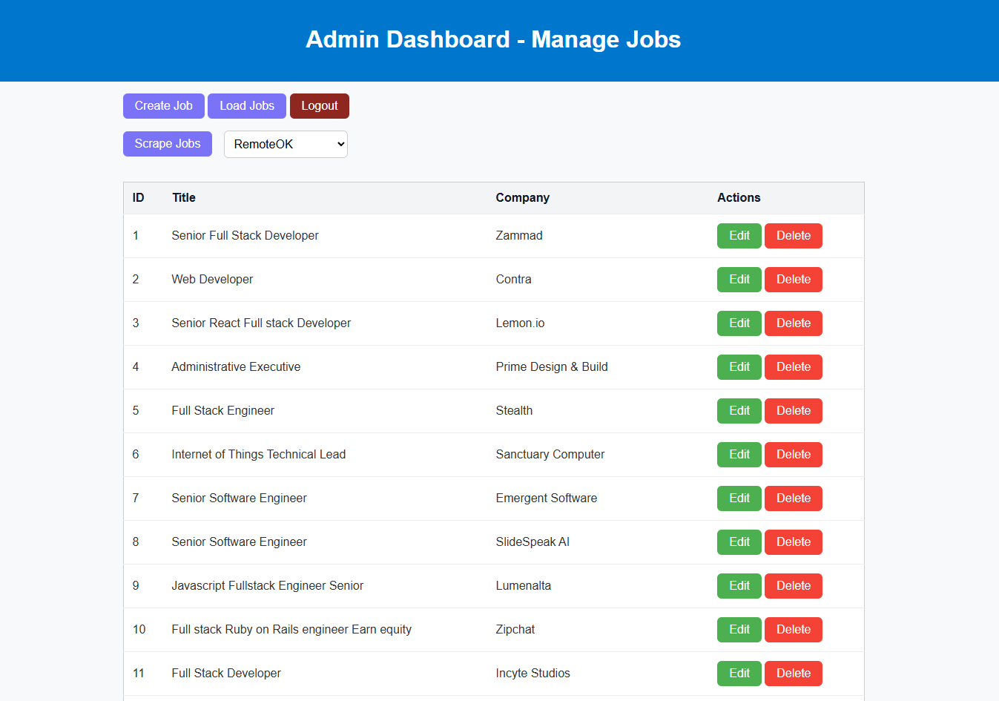
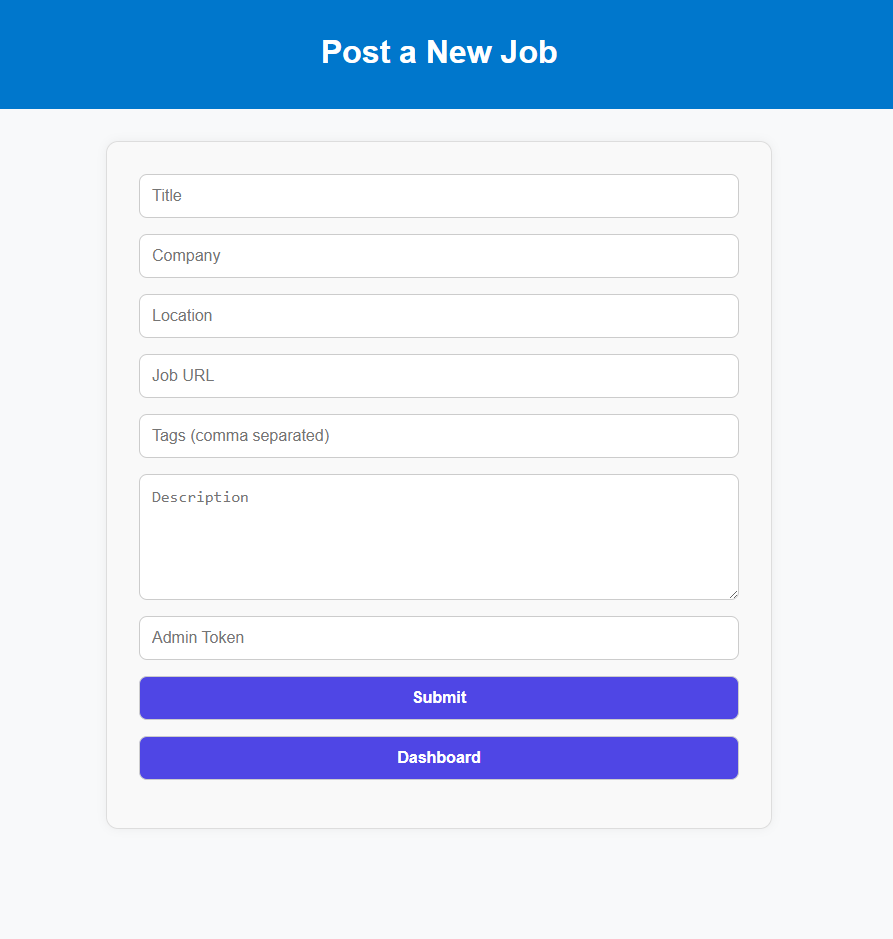

# Job Board App

A simple job aggregator web app built with **FastAPI**, **PostgreSQL**, and **BeautifulSoup**. Job seekers can search for dev jobs based on tags and keywords, while admins can manage listings, scrape new jobs, or create them manually.

---

## Contents

- [Features](#features)
- [Tech Stack](#tech-stack)
- [Usage](#usage)
- [How to Install](#how-to-install)
- [Development](#development)
- [License](#license)

---

## Features

- Filter and search jobs by title, company, location or tags.
- Admin dashboard for creating, updating, deleting, and scraping job listings.
- Secure access for admins using tokens.
- Scrape jobs from different sources.
- Automatically extract tags (clean and in lowercase) from job titles.
- Simple HTML/CSS/JS frontend integrated with FastAPI.
- Docker-ready setup for production deployment.

---

## Tech Stack

- **Backend:** FastAPI (Python)
- **Frontend:** HTML, CSS, JavaScript
- **Database:** PostgreSQL
- **ORM:** SQLAlchemy
- **Web Scraping:** BeautifulSoup
- **Task Automation:** Custom scraping logic (per site)
- **Dev Tools:** Alembic, Docker

---

## Usage

1. Easy access for job seekers looking for a dev job.



2. Admins can login and create, update, delete or scrap with a click from different sites.

- Admin login using his token:



- Admin's dashboard:



- Admin's add new job page:



---

## How to Install

### Prerequisites

-Docker & Docker Compose
-Python 3.11 (for local dev)

1. Clone the repository

```bash
git clone https://github.com/yourusername/job-board-app.git
```


2. Set up enviroment variables:

Create a `.env` file in the root directory (job-board-app) and add the following variables:

```
PROJECT_NAME="Job Board App"
API_V1_STR="/api/v1"
ADMIN_TOKEN="<your-admin-token>"
DATABASE_URL="postgresql://<your-username>:<your-password>@db/job_board_db"
```


3. Docker Setup:

Run the following command to start the application and database container:

```bash
docker-compose up --build
```

This will build and start the `job-board-app` and `job_board_db` containers and run `albemic` (on start) to set up the database (create the `job_posts` table). 

4. Run the application:

The app will be running at http://localhost:8000.

---

## Development
Running locally without Docker:

1. Install the dependencies:

```bash
pip install -r requirements.txt
```

2. Set up the environment variables in `.env`:

If you don't use postgres container, you may need to change the `DATABASE_URL` to `localhost`:

```
DATABASE_URL=postgresql://<your-username>:<your-password>@localhost:5432/job_board_db
...
```

3. Create a PostgreSQL database named `job_board_db`.

4. Run Alembic Migrations locally:

```bash
alembic upgrade head
```

5. Run the FastAPI app:

```bash
uvicorn app.main:app --reload
```

6. Access the app at http://localhost:8000.

---

## License

This project is licensed under the MIT License.